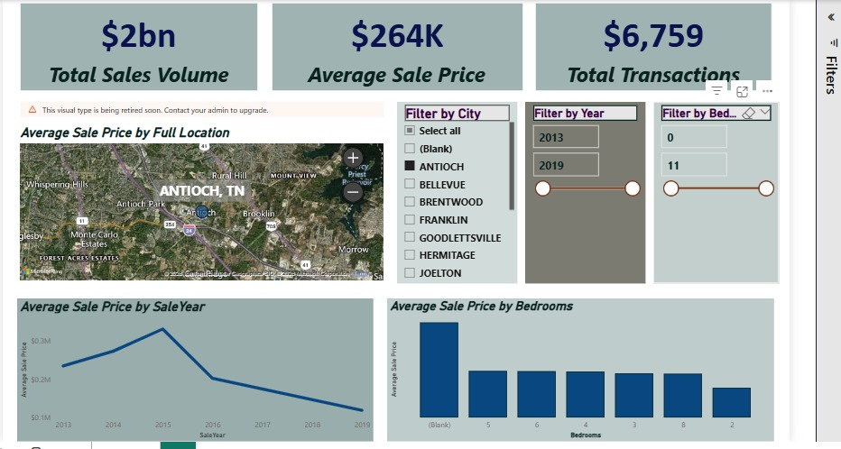

# 🏙️ Nashville Real Estate AVM & Market Analytics


## 🚀 Live Demos
* **Web Application:** [Nashville Real Estate AVM (Streamlit)](https://nashville-real-estate-avm-ntswopkzofmrbggiictntq.streamlit.app/)
* **Interactive Dashboard:** [Market Analytics (Power BI)](https://app.powerbi.com/links/DyfUuJE_wg?ctid=34bd8bed-2ac1-41ae-9f08-4e0a3f11706c&pbi_source=linkShare)

## 📊 Power BI Market Analytics


## 📌 Project Overview
An end-to-end full-stack data engineering and machine learning project predicting real estate prices in Davidson County, Nashville. This project encompasses cloud database management, automated data cleaning, geospatial enrichment, in-depth data analysis, predictive modeling, and a live BI dashboard deployed via a web application.

The goal of this project is to demonstrate a production-ready data pipeline: extracting raw data, transforming it into a Star Schema within an Azure Cloud environment, analyzing market trends, and serving insights to both an AI model and an executive-level dashboard.

## 🏗️ Architecture & Workflow

### 1. Cloud Data Engineering (Azure SQL)
* **Data Transformation:** Uploaded raw housing data to **Azure SQL Database** and executed comprehensive SQL scripts to standardize formats, handle missing address data via self-joins, and parse strings into granular components (Address, City, State).
* **Data Warehousing:** Engineered a **Star Schema** (Fact and Dimension tables) optimized for fast analytical querying.
* **Views:** Created specialized views connected directly to the BI layer.

### 2. Exploratory Data Analysis & Feature Engineering (Python & Pandas)
Before feeding data to the AI model, rigorous data analysis was performed to uncover market patterns:
* **Descriptive Statistics:** Utilized Pandas to generate statistical summaries (mean, standard deviation, quartiles) to understand the distribution of sale prices, lot sizes, and room counts.
* **Geospatial Analysis:** Leveraged the `geopy` Nominatim API to dynamically reverse-geocode property locations and extract Latitude/Longitude coordinates for spatial price mapping.
* **Trend Analysis (Time Series):** Evaluated historical sales data to map out macroeconomic pricing trends across different years.
* **Feature Engineering:** Synthesized new analytical columns, such as calculating exact `PropertyAge` from the `YearBuilt` and sale dates, which proved crucial for model accuracy.

### 3. Machine Learning (Python)
* **Predictive Modeling:** Trained a **Random Forest Regressor** to act as an Automated Valuation Model (AVM) based on property age, acreage, and room counts.
* **Performance:** Evaluated the model using Root Mean Squared Error (RMSE), Mean Absolute Error (MAE), and R² metrics to establish feature importance.

### 4. Business Intelligence (Power BI)
* **DirectQuery Connection:** Built a highly interactive Power BI dashboard connected live to the Azure SQL Database via DirectQuery, ensuring real-time data visibility.
* **Visual Analytics:** Features dynamic KPI cards ($2bn+ Total Sales Volume), geospatial maps for average price by location, line charts for time-series pricing trends, and categorical breakdowns by bedroom count.
* **Interactive Slicing:** Users can slice the data dynamically by City, Year, and Property Size.

### 5. Application Deployment (Streamlit)
* **UI/UX:** Wrapped the AI model and the Power BI dashboard into a sleek, dark-themed Streamlit web application.
* **Interactivity:** Users can input property features to receive real-time estimated market values, confidence intervals, and dynamic property tier categorizations.

## 🧠 Key AI Insights & Results
* **Primary Drivers:** The Random Forest model identified **Property Age** and **Acreage (Lot Size)** as the most significant drivers of valuation in the Nashville market.
* **Model Training:** Trained on ~20,600 historical records and tested on ~5,150 records.
* **Accuracy:** Achieved an R² score of **0.468**.

## 📂 Repository Structure
```text
├── data_engineering_pipeline.sql   # Complete ETL & Star Schema SQL script
├── nashvill.ipynb                  # Jupyter Notebook for EDA, ML, and Geocoding
├── app.py                          # Streamlit Web Application code
├── nashville_rf_model.zip          # Zipped Random Forest model
├── model_features.pkl              # Serialized model features
├── dashboard.jpeg                  # Dashboard screenshot
├── requirements.txt                # Python dependencies
└── README.md                       # Project documentation
